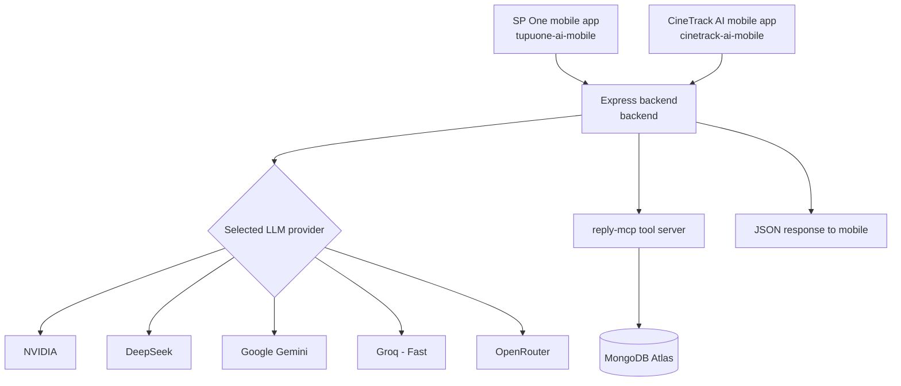
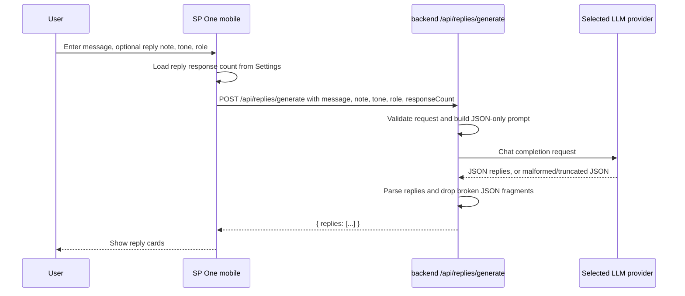
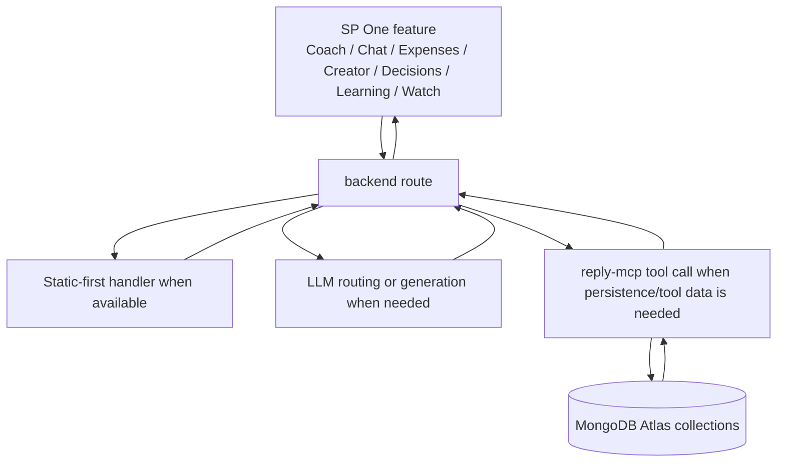
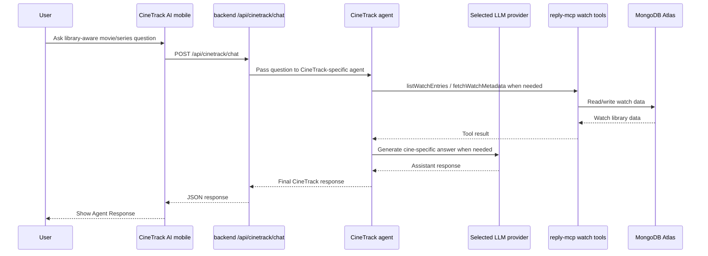
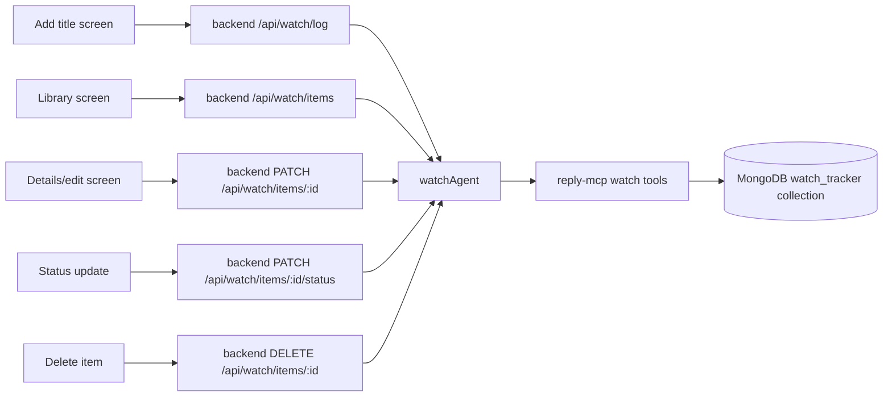
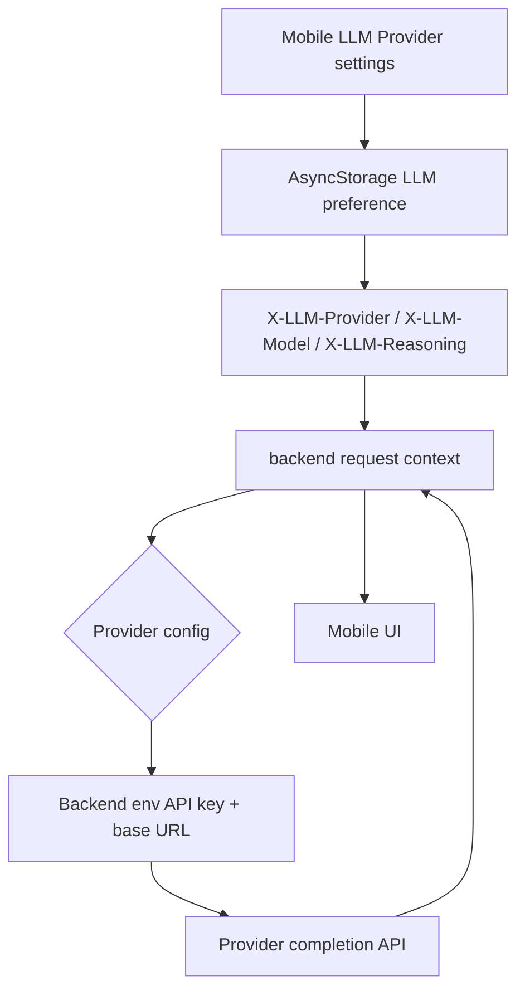

# Flow Diagram

This file documents the current request flows for SP One, CineTrack AI, the shared backend, and the MCP tool server.

## High-Level System Flow

## SP One Reply Flow

## SP One Feature Tool Flow

## CineTrack AI Chat Flow

## Watch Tracker Data Flow

## LLM Provider Selection Flow

